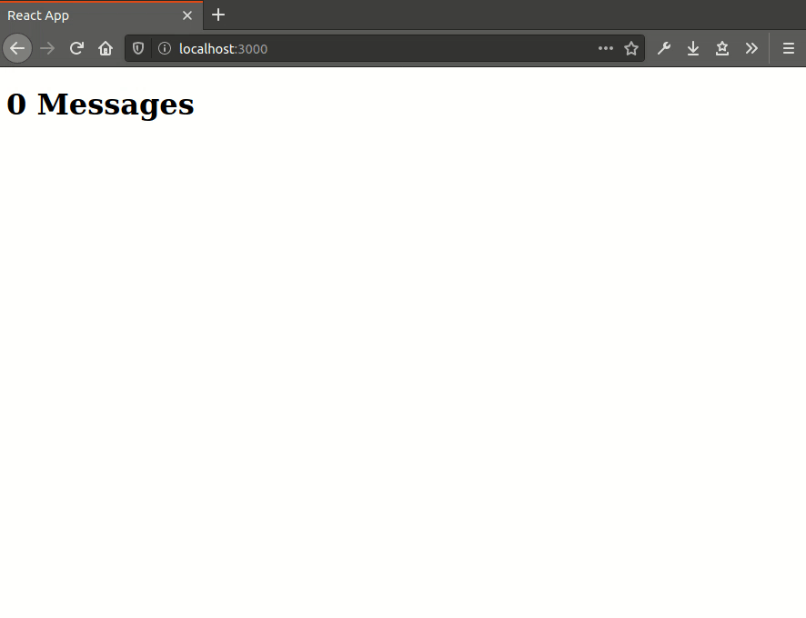

# POC: Kafka and SSE

It demonstrates how to produce and consume [Kafka](https://github.com/apache/kafka) events and expose them using [Server-Sent Events](https://en.wikipedia.org/wiki/Server-sent_events) (SSE).

We want to have an application based on streams of events managed by Kafka. To achieve that goal we have three participants.

The `producer` is a Java program that sends random messages to a Kafka topic.

The `consumer` is a Node.js server that reads messages from the topic when HTTP requests are made and streams those messages back (SSE).

The `client` is a React application that communicates to the consumer that it wants the messages and renders each of it on the screen.

## How to run

### Infrastructure

| Description | Command |
| :--- | :--- |
| Provision | `make infra-up` |
| Destroy | `make infra-down` |
| Show logs | `make infra-logs` |

### Services

| Description | Command |
| :--- | :--- |
| Run producer | `make run-producer` |
| Run consumer | `make run-consumer` |
| Run client | `make run-client` |

## Preview

